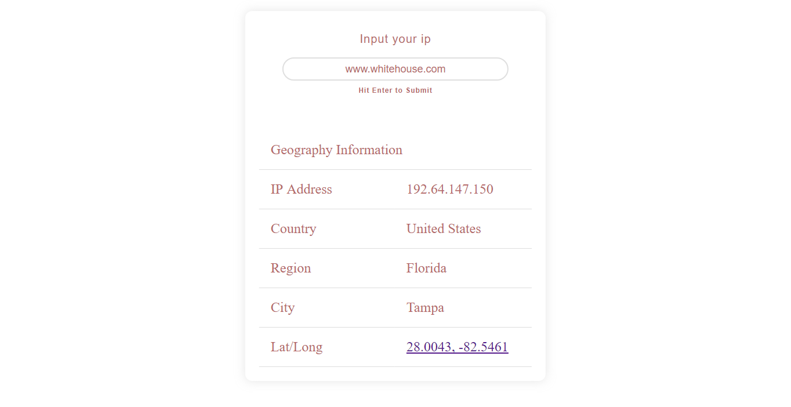
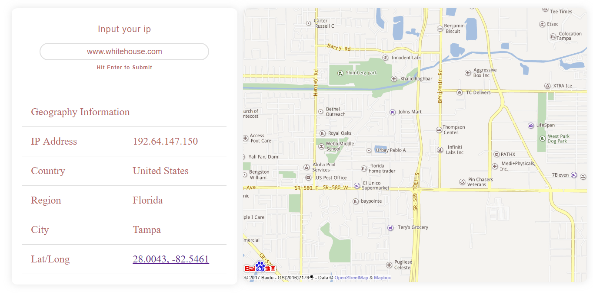

# IP 地理信息查询

这个程序使用 ~~[freegeoip.net](http://freegeoip.net)~~ [百度地图IP定位API](https://lbsyun.baidu.com/index.php?title=webapi/ip-api)，来返回给定 IP 的地理信息，包括：省份、城市以及经纬度等等。此外，该程序还调用了[百度地图API](http://lbsyun.baidu.com/)来显示 IP 所在城市的地图。

~~这个程序并无新意，只是学习 JSONP 时所用，练习如何跨域调用API，然后自定义了 UI 、增添了些动画效果~~2016年刚开始学习编程时写的 demo ，像个旧玩具一般:smile:~~[点此尝试](https://yibailin.github.io/geo-ip/)~~，（暂时还不能使用，等待服务器端部署api）。效果如下：

### 搜索框：

		

#### 地理信息查询结果：

	

#### 该地区经纬度的地图显示：

## test